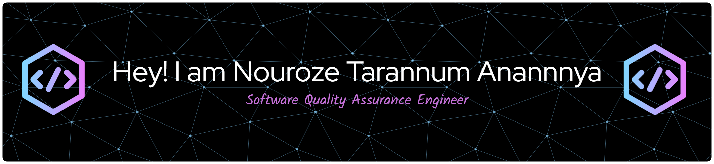

<!--- banner --->

 

<h1 align="center">Hi 👋, I'm Nouroze Tarannum Anannya</h1>
<h3 align="center">A passionate Software Quality Assurance Engineer From Bangladesh</h3>

- 🔭 I’m currently working on **SmartTransit - A Public Transport Assistant Platform**

- 🌱 I’m currently learning **Selenium**

- 👨‍💻 All of my projects are available at [https://github.com/Nouroze-Tarannum-Anannya?tab=repositories](https://github.com/Nouroze-Tarannum-Anannya?tab=repositories)

- 💬 Using **Postman for API Testing**

- 📫 How to reach me **nourozetarannum@gmail.com**

- 📄 My resume [Nouroze Tarannum Anannya-CV](https://drive.google.com/file/d/1HVGE7NhAbor-jtEa2dmRVNXgaZTjPiuL/view?usp=sharing)

<h3 align="left">Connect with me:</h3>

<h3 align="left">💻 Programming Languages</h3>

        

<h3 align="left">🌐 Frontend Development</h3>

       

<h3 align="left">🗄️ Backend Development</h3>

     

<h3 align="left">🧪 Software Testing & QA</h3>

   

<h3 align="left">⚙️ Tools, Platforms & Others</h3>

     

